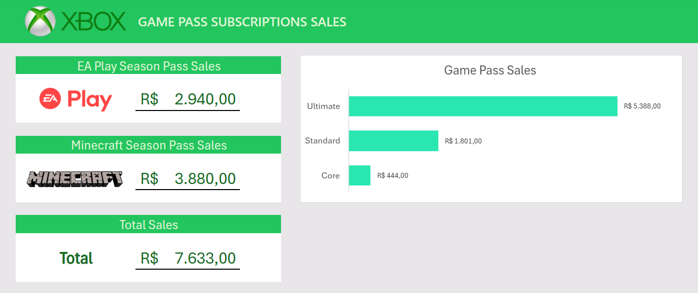

# Criando um Dashboard de Vendas do Xbox com Excel

O objetivo desse desafio foi desenvolver um dashboard das vendas dos serviços do Xbox, seguindo as instruções do instrutor.

Os dados necessários estavam disponibilizados para download.

**Foram criadas tabelas dinâmicas para a exibição dos seguintes dados:**
- Vendas do Game Pass separados em planos: Core, Standard e Ultimate
- Vendas do EA Play Season Pass
- Vendas do Minecraft Season Pass

**Criação do dashboard:**
- Foi feito o Layout do título com a logo do Xbox
- Foi criado um gráfico em barras para a exibição das vendas do Game Pass
- Foi criado áreas para a exibição das vendas do EA Play e Minecraft Season Pass

Nas instruções do vídeo foi adicionado um menu para seleção do tipo do plano (Mensal, trimestral e anual), porém na versão web do Excel, não foi possível copiar esse menu para o dashboard. Algumas outras funcionalidades não estavam presentes ou não funcionavam como nos vídeos, então o dashboard desenvolvido teve algumas alterações.

## Dashboard

